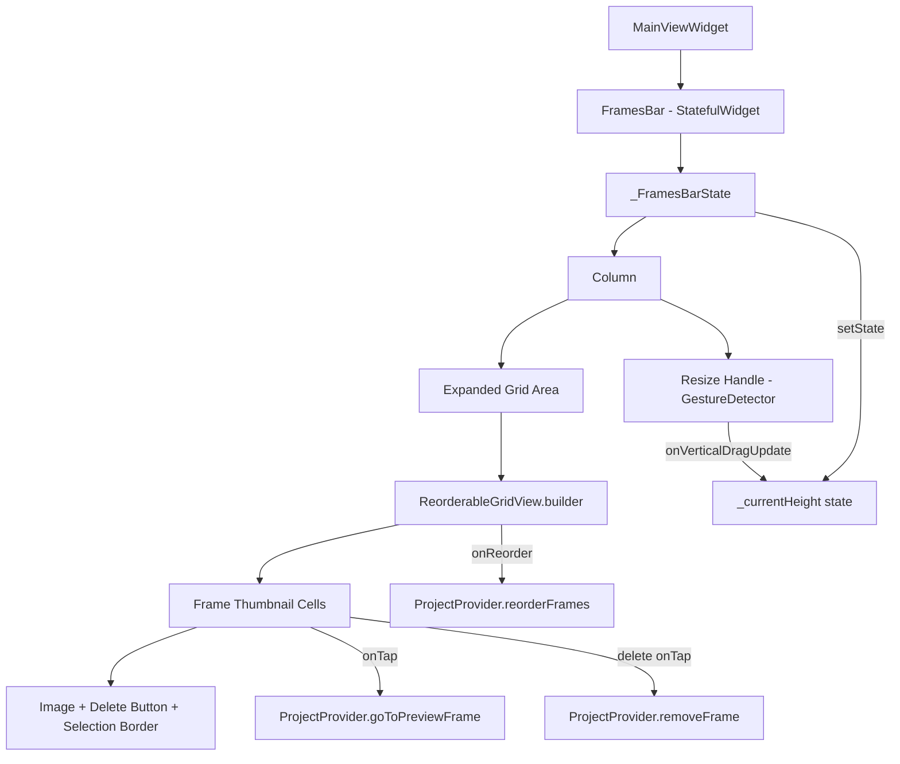
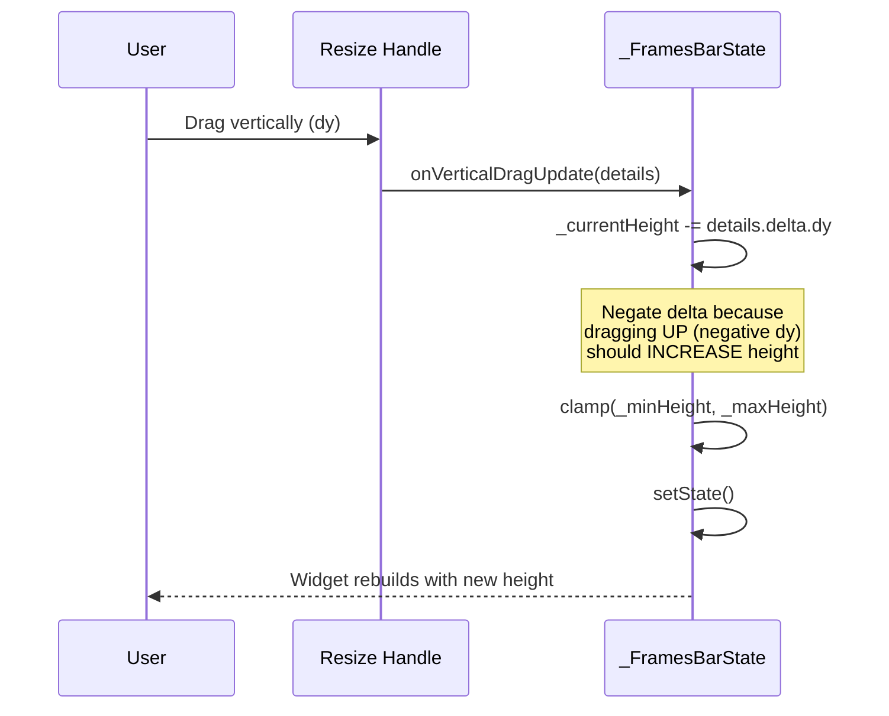
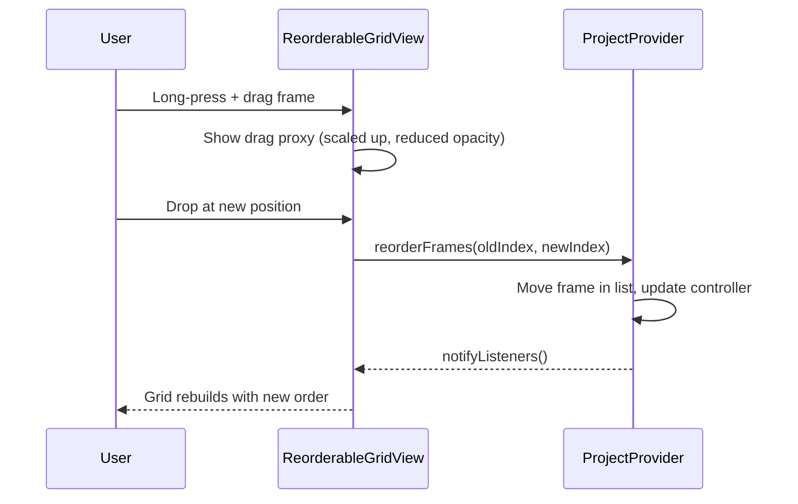

# Design Document: Reorderable Grid Frames Bar

## Overview

This feature transforms the FramesBar widget from a horizontal `ReorderableListView` into a resizable `ReorderableGridView`. The FramesBar currently displays frame thumbnails in a single horizontal row with a fixed 200px height. The redesign introduces a grid layout using the `reorderable_grid` package, allowing multiple rows of thumbnails, and adds a drag handle at the top edge so users can resize the panel height between 120px and 400px. The widget transitions from `StatelessWidget` to `StatefulWidget` to manage the local height state.

## Architecture



## Components and Interfaces

### Component 1: FramesBar (StatefulWidget)

**Purpose**: Top-level widget that creates the state object. Replaces the current `StatelessWidget`.

```dart
class FramesBar extends StatefulWidget {
  const FramesBar({super.key});

  @override
  State<FramesBar> createState() => _FramesBarState();
}
```

**Responsibilities**:
- Serve as the public API (remains `const FramesBar()` in main_view.dart)
- Create and own the `_FramesBarState`

### Component 2: _FramesBarState

**Purpose**: Manages the resizable height state and builds the widget tree.

```dart
class _FramesBarState extends State<FramesBar> {
  double _currentHeight = 200.0;

  static const double _minHeight = 120.0;
  static const double _maxHeight = 400.0;
  static const double _handleHeight = 16.0;
}
```

**Responsibilities**:
- Hold `_currentHeight` as local state
- Handle vertical drag gestures to resize
- Build the Column containing the resize handle and grid area
- Clamp height within min/max bounds

### Component 3: Resize Handle

**Purpose**: A GestureDetector at the top of the FramesBar that allows vertical dragging to resize the panel.

```dart
Widget _buildResizeHandle(FluentThemeData theme) {
  return MouseRegion(
    cursor: SystemMouseCursors.resizeRow,
    child: GestureDetector(
      onVerticalDragUpdate: _onDragUpdate,
      child: Container(
        height: _handleHeight,
        width: double.infinity,
        alignment: Alignment.center,
        child: Container(
          width: 40,
          height: 4,
          decoration: BoxDecoration(
            color: theme.resources.textFillColorSecondary,
            borderRadius: BorderRadius.circular(2),
          ),
        ),
      ),
    ),
  );
}
```

**Responsibilities**:
- Display a visual grip indicator (centered horizontal pill)
- Show a vertical resize cursor on hover
- Capture vertical drag gestures and forward to `_onDragUpdate`

### Component 4: ReorderableGridView

**Purpose**: Displays frame thumbnails in a grid layout with drag-to-reorder support.

```dart
ReorderableGridView.builder(
  gridDelegate: SliverGridDelegateWithFixedCrossAxisCount(
    crossAxisCount: crossAxisCount,
    mainAxisSpacing: 10,
    crossAxisSpacing: 10,
    childAspectRatio: 100 / 130, // accounts for label below thumbnail
  ),
  itemCount: frames.length,
  onReorder: state.reorderFrames,
  padding: const EdgeInsets.symmetric(horizontal: 20, vertical: 8),
  itemBuilder: (context, index) => _buildFrameTile(context, state, frames, index, currentFrame, theme),
)
```

**Responsibilities**:
- Lay out frame thumbnails in a responsive grid
- Calculate `crossAxisCount` based on available width
- Handle reorder callbacks
- Provide drag proxy decoration

## Data Models

### Height State

```dart
// Local to _FramesBarState — no persistence needed
double _currentHeight = 200.0; // initial height in logical pixels
```

**Validation Rules**:
- Must be >= 120.0 (minimum height)
- Must be <= 400.0 (maximum height)
- Updated via `setState` on each drag update

### Grid Layout Calculation

```dart
// crossAxisCount derived from available width
int _calculateCrossAxisCount(double availableWidth) {
  const double cellWidth = 110.0; // 100px thumbnail + 10px spacing
  return (availableWidth / cellWidth).floor().clamp(1, 20);
}
```

## Sequence Diagrams

### Resize Interaction



### Frame Reorder Interaction



## Key Functions with Formal Specifications

### Function: _onDragUpdate

```dart
void _onDragUpdate(DragUpdateDetails details) {
  setState(() {
    _currentHeight = (_currentHeight - details.delta.dy).clamp(_minHeight, _maxHeight);
  });
}
```

**Preconditions:**
- `details.delta.dy` is a finite double value
- `_currentHeight` is within `[_minHeight, _maxHeight]`

**Postconditions:**
- `_currentHeight` remains within `[_minHeight, _maxHeight]`
- Dragging up (negative dy) increases height
- Dragging down (positive dy) decreases height
- Widget rebuilds with the new height

### Function: _calculateCrossAxisCount

```dart
int _calculateCrossAxisCount(double availableWidth) {
  const double cellWidth = 110.0;
  return (availableWidth / cellWidth).floor().clamp(1, 20);
}
```

**Preconditions:**
- `availableWidth` is a positive finite double

**Postconditions:**
- Returns an integer >= 1
- Returns an integer <= 20
- Result increases as `availableWidth` increases

### Function: build (in _FramesBarState)

```dart
@override
Widget build(BuildContext context) {
  // Returns Selector<ProjectProvider, ProjectProvider> wrapping:
  //   Container(height: _currentHeight)
  //     -> Column
  //       -> _buildResizeHandle(theme)
  //       -> Expanded(child: ReorderableGridView.builder(...))
}
```

**Preconditions:**
- `context` has a `ProjectProvider` ancestor
- `FluentTheme.of(context)` is available

**Postconditions:**
- Renders a container with height equal to `_currentHeight`
- Contains a resize handle at the top
- Contains a grid of frame thumbnails filling remaining space
- All existing interactions (tap to select, tap delete, drag to reorder) are preserved

## Example Usage

```dart
// In main_view.dart — no change to the call site
class MainViewWidget extends StatelessWidget {
  const MainViewWidget({super.key});

  @override
  Widget build(BuildContext context) {
    return Container(
      color: FluentTheme.of(context).micaBackgroundColor,
      child: Column(
        children: [
          Expanded(child: PreviewWidget()),
          ButtonsBar(),
          const FramesBar(), // Still const, still at the bottom
        ],
      ),
    );
  }
}
```

```dart
// Internal structure of the FramesBar build output
Container(
  height: _currentHeight, // 120..400, default 200
  decoration: BoxDecoration(color: theme.cardColor),
  width: double.infinity,
  child: Column(
    children: [
      _buildResizeHandle(theme),       // 16px tall drag handle
      Expanded(
        child: LayoutBuilder(
          builder: (context, constraints) {
            final crossAxisCount = _calculateCrossAxisCount(constraints.maxWidth);
            return ReorderableGridView.builder(
              gridDelegate: SliverGridDelegateWithFixedCrossAxisCount(
                crossAxisCount: crossAxisCount,
                mainAxisSpacing: 10,
                crossAxisSpacing: 10,
                childAspectRatio: 100 / 130,
              ),
              // ... itemBuilder, onReorder, etc.
            );
          },
        ),
      ),
    ],
  ),
)
```

## Error Handling

### Error Scenario 1: Zero or Negative Available Width

**Condition**: LayoutBuilder reports 0 or negative maxWidth (e.g., during layout transitions)
**Response**: `_calculateCrossAxisCount` clamps to minimum of 1 column
**Recovery**: On next layout pass, correct width is provided and grid adjusts

### Error Scenario 2: Empty Frames List

**Condition**: `currentAnimation.frames` is empty
**Response**: Display `SizedBox.shrink()` instead of the grid (preserving current behavior)
**Recovery**: When frames are added, the grid appears automatically via provider notification

### Error Scenario 3: Drag Beyond Bounds

**Condition**: User drags resize handle beyond min/max height limits
**Response**: Height is clamped to `[120, 400]` — no error thrown
**Recovery**: Automatic; user can drag back in the opposite direction

## Correctness Properties

*A property is a characteristic or behavior that should hold true across all valid executions of a system — essentially, a formal statement about what the system should do. Properties serve as the bridge between human-readable specifications and machine-verifiable correctness guarantees.*

### Property 1: Height Clamping Invariant

For any sequence of drag updates with arbitrary `delta.dy` values, the resulting `_currentHeight` SHALL always be within `[120.0, 400.0]`.

**Validates: Requirements 4.3, 4.4, 4.5, 4.6**

### Property 2: Cross-Axis Count Positivity

For any positive `availableWidth`, `_calculateCrossAxisCount(availableWidth)` SHALL return an integer >= 1.

**Validates: Requirements 1.1, 1.2**

### Property 3: Reorder Preserves Frame Count

For any valid `oldIndex` and `newIndex`, calling `reorderFrames` SHALL not change the total number of frames in the animation.

**Validates: Requirements 2.2**

### Property 4: Drag Direction Correctness

For any drag update where `delta.dy < 0` (dragging up), the resulting height SHALL be greater than or equal to the previous height (up to the max clamp). Conversely, `delta.dy > 0` (dragging down) SHALL result in height less than or equal to the previous height (down to the min clamp).

**Validates: Requirements 4.2**

### Property 5: Selection Idempotence

For any valid frame index, calling `goToPreviewFrame(index)` twice in succession SHALL result in the same selected frame state as calling it once.

**Validates: Requirements 3.1, 3.2**

## Testing Strategy

### Unit Testing Approach

- Test `_calculateCrossAxisCount` with various widths (edge cases: very small, very large, exact multiples of cell width)
- Test height clamping logic in isolation
- Test that the widget tree structure is correct via widget tests

### Property-Based Testing Approach

- Generate random sequences of drag deltas and verify height invariant holds
- Generate random available widths and verify cross-axis count is always >= 1
- Generate random reorder operations and verify frame count preservation

**Property Test Library**: `fast_check` (Dart) or manual randomized test loops with `dart:math`

### Integration Testing Approach

- Widget test: render FramesBar with mock ProjectProvider, verify grid renders correct number of tiles
- Widget test: simulate drag on resize handle, verify height changes
- Widget test: simulate tap on frame thumbnail, verify `goToPreviewFrame` is called

## Dependencies

- **reorderable_grid** (pub.dev): Provides `ReorderableGridView.builder()` with grid-based drag-and-drop reordering
- **fluent_ui** (existing): UI framework for theming and icons
- **provider** (existing): State management for ProjectProvider access
